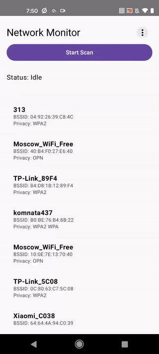

[Демонстрация работы приложения](#демонстрация-работы-приложения)

[Основные компоненты](#основные-компоненты)

## Демонстарция работы приложения

Перевод в режим мониторинга и сканирование сетей  
  
  
  
Мониторинг, деаутентификация и сбор .cap файла  
.gif)  
  
  
Перевод модема в обычный режим, отправка файла на сервер и отслеживание состояния  
.gif)

## Основные компоненты

[DataManager](data/DataManager.kt) - центральный модуль управления данными и операциями:
1. Выполняет команды в chroot-окружении NetHunter
2. Управляет сканированием сетей и сбором handshake
3. Обрабатывает и отправляет захваченные файлы на сервер

[ScanScreen](ScanScreen.kt) - основной экран сканирования сетей:
1. Отображает список доступных сетей
2. Предоставляет управление процессом сканирования
3. Позволяет переходить к детальной информации о сети

[NetworkDetailScreen](NetworkDetailScreen.kt) - экран детальной информации о сети:
1. Показывает подробную информацию о выбранной сети
2. Предоставляет функции мониторинга и деаутентификации
3. Управляет сбором handshake для конкретной сети

[MainActivity](MainActivity.kt) - основная активность приложения:
1. Инициализирует навигацию между экранами
2. Настраивает основной UI приложения

[CapturedFilesScreen](CapturedFilesScreen.kt) - экран управления захваченными файлами:
1. Отображает список захваченных handshake
2. Позволяет отправлять файлы на сервер для обработки
3. Показывает статус обработки файлов

[Network](models/Network.kt) - модель данных Wi-Fi сети:
1. Хранит информацию о сети (BSSID, SSID, канал, шифрование и т.д.)
2. Используется для отображения и обработки данных о сетях

[CapturedFile](models/CapturedFile.kt) - модель данных захваченного файла handshake:
1. Содержит информацию о файле (имя, статус, позиция в очереди)
2. Используется для управления и отображения захваченных handshake

[NetworkAdapter](adapters/NetworkAdapter.kt) - адаптер для отображения списка сетей:
1. Конвертирует данные модели Network в формат для отображения
2. Обрабатывает взаимодействие пользователя со списком сетей

[CapturedFileAdapter](adapters/CapturedFileAdapter.kt) - адаптер для отображения списка захваченных файлов:
1. Преобразует данные CapturedFile для отображения
2. Управляет действиями с захваченными файлами (отправка, проверка статуса)

